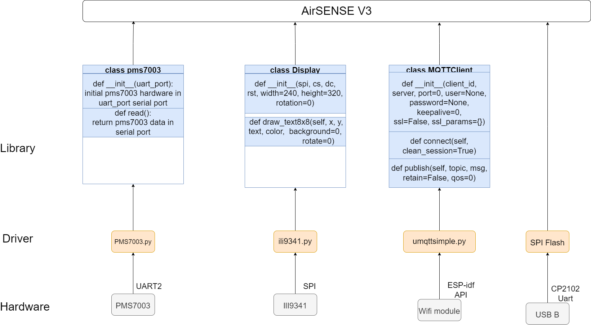
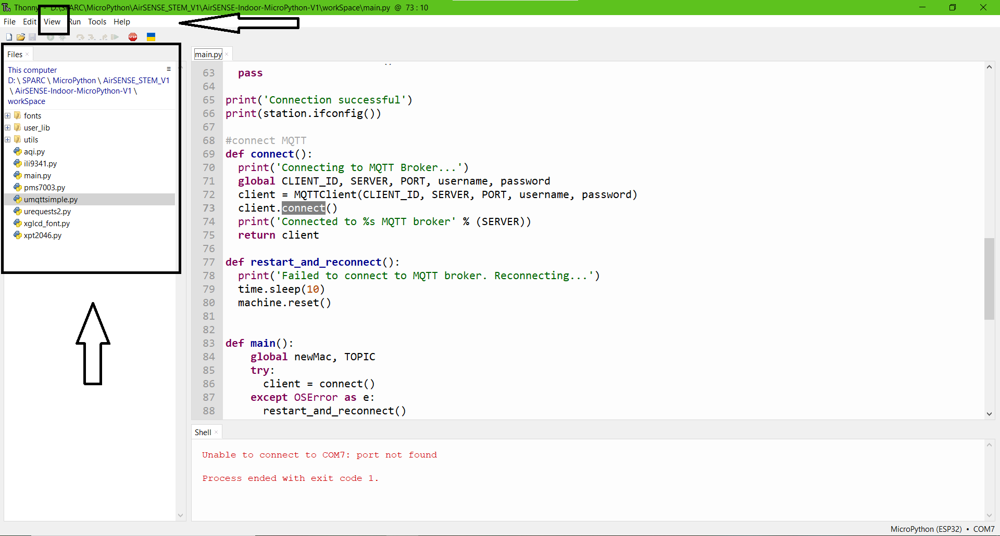
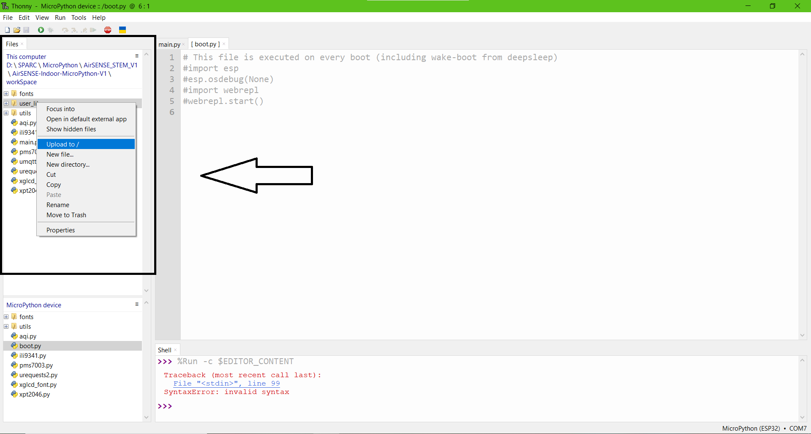
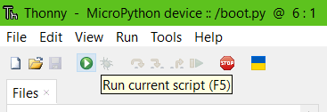

#Mã nguồn AirSENSE V3 sử dụng ngôn ngữ MicroPython

**Link in conflunce:** [Demo MicroPython version 1.0](https://airsense.atlassian.net/wiki/spaces/AIRSENSE/pages/3964936/Demo+MicroPython+version+1.0)  

This repository provides you with a detailed guide on how to build a IOT device with AirSENSE Hardware and firmware by micropython. The source code of the repository is a part of AirSENSE-Education
  
### Table of Contents

- [Real-time Auto License Plate Recognition with Jetson Nano](#real-time-auto-license-plate-recognition-with-jetson-nano)
    - [Table of Contents](#table-of-contents)
  - [Architecture](#Architecture)
  - [Installing tools ](#Tools)
  - [How to use the source code](#upload)
  
  
## Architecture

This project is developed based on the pipeline described below.   

  

## Tools

install the IDE and tool in this tutorial: [Getting started thonny micropython](https://randomnerdtutorials.com/getting-started-thonny-micropython-python-ide-esp32-esp8266/  ) 

## Upload

To prepare your device, you’ll need a computer with Internet connection and an USB-B capble can transfer datat.
1. Download the code [AirSENSE-Indoor-MicroPython-V1](https://github.com/Air-SENSE/AirSENSE-Indoor-MicroPython-V1/archive/refs/heads/main.zip), and note where it was saved on the computer.
2. Unzip all the files in your download, open with Thonny:
    * Select View -> File.
    * Select folder where you unzip file code, select to workspace folder.

    

3. Connect PC with AirSENSE Device.

4. Use Thonny, upload all files in File View in the left of display (note: you must setting Thonny with steps above):

    

5. When you finish unload file, open the main.py file, run with Run Script button (or F5).

run file default: main.py  

    

